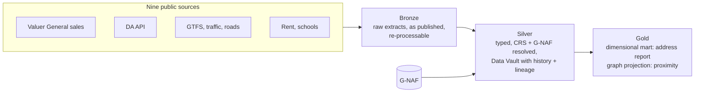

# Suburblens: integrated address-level property reporting

UTS 32113 Advanced Database, Assignment 1 (4 September 2026).
This repository implements the architecture recommended in the report:
a **medallion lakehouse** with a **Data Vault** Silver layer, a **dimensional**
Gold mart for the address report, and a **graph projection** for
"what's happening around here" queries.

## The problem

Greater Sydney is expected to grow by 1.4 million people by 2041, mostly by
densifying streets that are already lived on. For a buyer, the surroundings
matter more than the house itself, especially change that has already been
approved but isn't visible yet. The information is public, but it's spread
across nine sources that share no common identifier, use different coordinate
reference systems, and refresh on seven different cycles.

Suburblens is a (fictional) Sydney PropTech firm that sells one product: a report
on the neighbourhood around a given address, for buyer's agents, conveyancers
and mortgage brokers. It owns no data. Its value is joining outside sources
against one address, which comes down to three modelling problems:

- **Entity resolution** against G-NAF (Geocoded National Address File), the
  natural address key. A wrong match is worse than none.
- **CRS standardisation**, so proximity queries are metrically valid (GDA94 vs
  GDA2020 offsets matter at lot scale).
- **Bitemporal history** (what happened when, and what we knew when), e.g. for
  development application (DA) status.

## Evaluation criteria

Every design decision in this repo is measured against the five weighted
criteria from the report (§2.4). C2 and C5 carry the most weight because they
can't be retrofitted.

| | Criterion | Weight | What it means in code |
|---|---|---:|---|
| C1 | Query performance at address level | 20 | Gold precomputes joins; the address report must not join raw sources at query time |
| C2 | Bitemporal history | 25 | Silver keeps every version with load time (transaction time) and effective dates (valid time); nothing is overwritten |
| C3 | Standardisation (units, CRS, spatial grain) | 15 | ISO dates, SI units, one project CRS, and G-NAF / cadastre join keys in Silver |
| C4 | Lineage and data quality at record level | 15 | Each row carries its source file and line; problems are flagged, never deleted |
| C5 | Safe incremental loading | 25 | Loads are idempotent: re-running changes nothing, and corrections add versions instead of editing delivered data |

## Architecture



| Layer | Holds | Model / technology (report Table 6) |
|---|---|---|
| **Bronze** | Raw source extracts, schema-free and re-processable, plus a parsed landing copy with lineage | Data Lake landing zone |
| **Silver** | Typed, deduplicated, versioned records. CRS transformation and G-NAF resolution happen here, once, at load time | Data Vault 2.0 (hubs / links / satellites) on the lakehouse; Data Fabric-style metadata for matching and lineage |
| **Gold** | Serving structures: a dimensional mart for the address report and a graph projection for proximity queries | Dimensional (Kimball) mart; graph layer / PostGIS or H3 spatial index |

Each source is treated as a **data product** with an explicit quality contract
covering freshness, completeness and suppression flags (report
Recommendation 4). It's owned by one team member and documented in its own
README.

## Data sources

The nine sources in the report (§2.2.1), plus G-NAF as the shared address key.

| # | Source | Area | Folder | Owner | Status |
|---|---|---|---|---|---|
| 1 | Valuer General NSW property sales (PSI) | Market history | `sources/property_sales/` | Kang Donghyun (Brian) | Bronze + Silver in progress |
| 2 | Quarterly district rent data | Market history | `sources/rent/` | | |
| 3 | Online DA Service API (daily status events) | Development pipeline | `sources/development_applications/` | | |
| 4 | Historical GTFS feeds | Transport | `sources/gtfs/` | | |
| 5 | NSW Station Stops | Transport | `sources/station_stops/` | | |
| 6 | Roads Traffic Volume | Transport | `sources/traffic_volume/` | | |
| 7 | Speed Zones | Transport | `sources/speed_zones/` | | |
| 8 | Sydney Region Carriageway | Transport | `sources/carriageway/` | | |
| 9 | NSW Government School Locations | Schools | `sources/school_locations/` | | |
| – | G-NAF (address identity) | Shared reference | `shared/` | | |

Folder names are suggestions. Claim a row by adding your name in your first PR.

## Repository layout

```
sources/                  one folder per data source, one owner each
  README.md               the source contract: how to add a source, conventions
  _template/              copy this to start a new source
  <source>/
    README.md             data-product card: publisher, licence, grain, cadence, gaps
    bronze/               fetch + parse raw -> landing (as published, with lineage)
    silver/               clean, type, standardise, version, flag
    sql/                  DDL / loads for this source's vault tables
    quality/              profiling, checks, dashboards
    reference/            small lookup tables that ship with the code
gold/                     cross-source marts and graph projections (reads Silver only)
shared/                   code needed by two or more sources (G-NAF matching, CRS, IO)
data_exploration/         notebooks, recon scripts, throwaway visualisations
data/                     git-ignored: data/<layer>/<source>/...
```

Data never goes into git. Everything a pipeline reads or writes lives under
`data/bronze/<source>/`, `data/silver/<source>/`, `data/gold/`, or
`data/reports/<source>/` for profiles and dashboards. Some publishers' licences
don't allow redistribution.

## Working in this repo

- Run stages as modules from the repo root, e.g.
  `python -m sources.property_sales.bronze.extract`.
- CI runs `pylint` on every tracked `.py` file (`.github/workflows/pylint.yml`)
  and installs nothing else. Stick to the standard library, or add a
  `requirements.txt` and install it in the workflow in the same PR.
- One branch per source, and a PR into `main` when a layer works end to end.
  Say in the PR how you ran it and what the output was.
- Conventions (paths, lineage columns, versioning, quality flags) are in
  [`sources/README.md`](sources/README.md).

## Known limits (report §4.5)

| Issue | Status |
|---|---|
| Historical zoning / rezoning | Not addressed: only current snapshots are published |
| Cross-source G-NAF matching | Partially addressed: match rules and thresholds must be defined and tested per source pair |
| Spatial indexing at GTFS scale | Partially addressed: needs PostGIS / H3 on top of the vault and lakehouse |
| DA coverage before mid-2021 | Not addressed: portal lodgement only became mandatory then |
| Spatial query performance | Not measured by C1–C5, which under-rates the graph layer |

## Team

Noah Meißner · Kang Donghyun (Brian) · Wujie Liang · Ryo Arimura · Taekyun Kim
